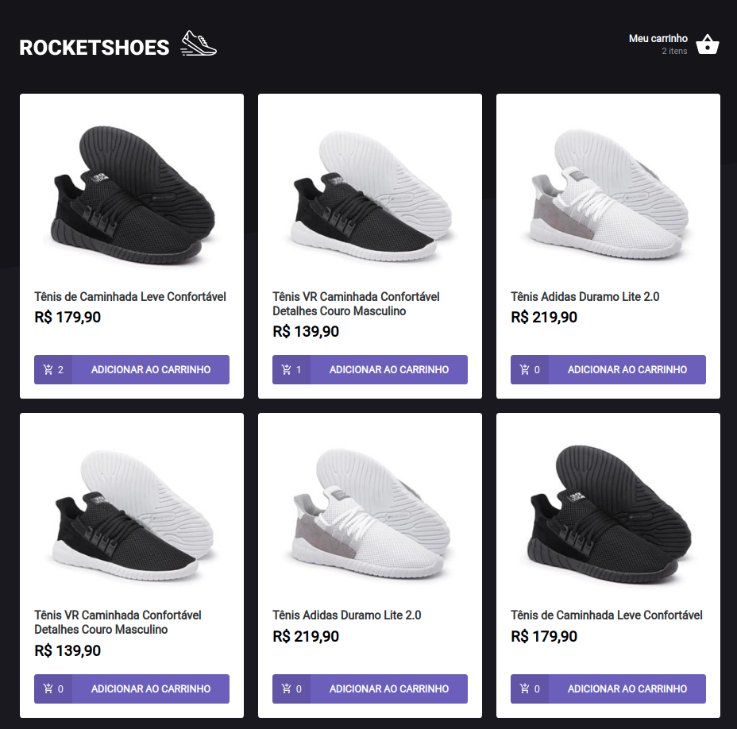
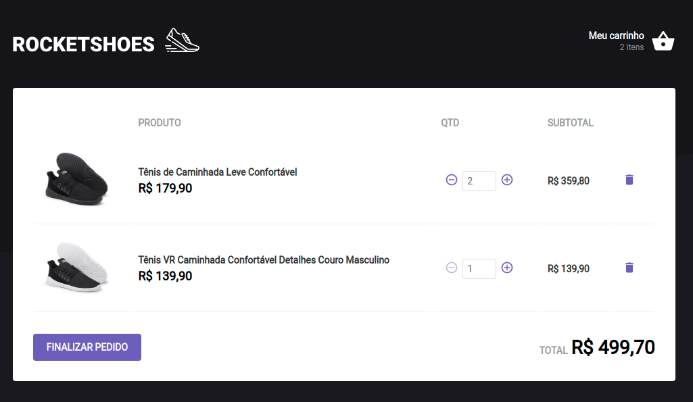

# Rocketshoes
Aplicação desenvolvida através de um desafio do ignite pela rocketseat. O objetivo é trabalhar conceitos que foram abordados no módulo do curso. A aplicação consiste em uma loja de sapatos. É possível adicionar itens no carrinho enquanto estiverem disponíveis no estoque. Todas informações do carrinho é armazenada na memória do navegador, dessa forma, os dados não são perdido ao atualizá-lo.

Esta aplicação possui 4 funcionalidades:
- Incluir mais um produto ao carrinho;
- Remover um item do produto do carrinho;
- Remover o produto do carrinho;
- Exibir a quantidade de produtos distintos no carrinho.

### Tecnologias utilizadas

- React;
- React Hooks;
- Context API;
- toastify;
- localStorage API;
- Typescript;
- styled-components;
- JSON Server;
- axios;
- yarn;

### Executando aplicação

##### Instalando dependências
```bash
  yarn
```

##### Start aplicação
```bash
  yarn dev
```

#### Home


#### Carrinho
